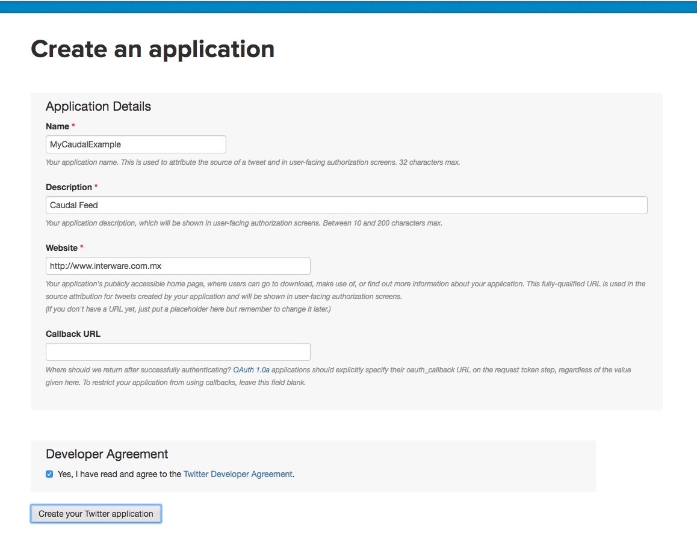
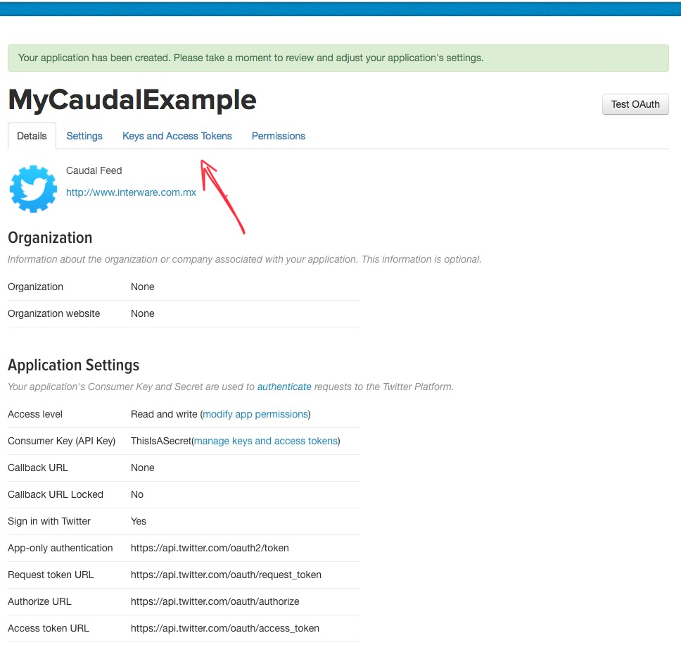
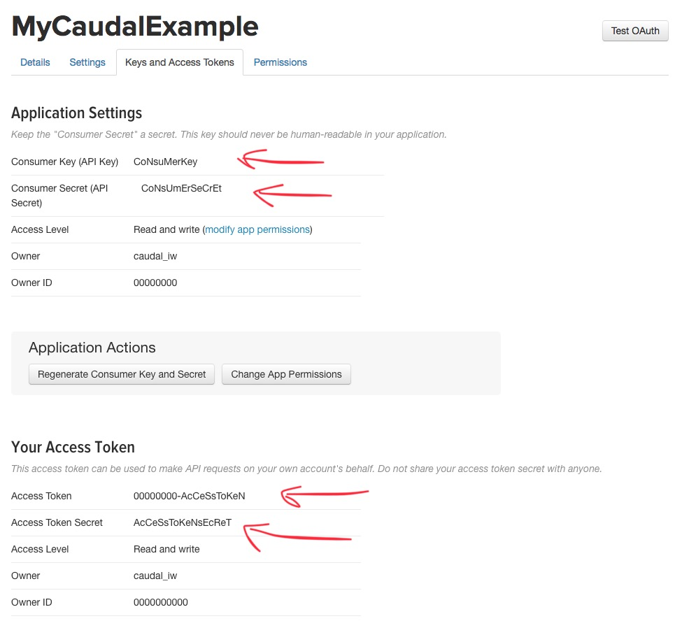

title: Lab 1 - Listeners
---

Listeners takes a datasource and feed our Caudal. 

## Requirements
 * [Setup](setup.html)
 * [Configuration](configuration.html)

## Configuration
Caudal defines `deflistener` macro to declare a new listener, receives a vector with a map that contains a `:type` and `:parameters`

```clojure
;; macro     ;; var-name  ;; listener-type
(deflistener foo-listener [{:type 'mx.interware.caudal.io.listener 
                            :parameters {:param1 "a"       ;; Ad-hoc params
                                         :param2 "b" ...}}])
```

| Element       | Description   |
| ------------- | ------------- |
| foo-listener  | Name of this listener. A configuration file can contain one or many listeners. |
| :type         | Symbol that points to a valid listener implementation. See `mx.interware.caudal.io` in [API](../api) section.|
| :parameters   | Map with parameters according with used listener. |


### TCP
In [Configuration](configuration.html) we used `deflistener` macro to define a TCP channel in port 9900:

```clojure
(deflistener tcp [{:type 'mx.interware.caudal.io.tcp-server
                   :parameters {:port        9900 
                                :idle-period 60}}])
```

| Parameter     | Description   |
| ------------- | ------------- |
| :port         | Number of port (1-65535) to listen events. Incoming events are received in [EDN](https://learnxinyminutes.com/docs/edn/) format.|
| :idle-period  | Idle period for socket|

#### Configuration

Write following configuration in `config/` directory:

```clojure config/example-tcp.clj
;; Requires
(ns caudal.example.tcp
  (:require
   [mx.interware.caudal.io.rest-server :refer :all]
   [mx.interware.caudal.streams.common :refer :all]
   [mx.interware.caudal.streams.stateful :refer :all]
   [mx.interware.caudal.streams.stateless :refer :all]))

;; Listeners
(deflistener tcp [{:type 'mx.interware.caudal.io.tcp-server
                   :parameters {:port 9900
                                :idle-period 60}}])
;; Sinks
(defsink example 1 ;; backpressure
  (->INFO [:all]))

;; Wire
(wire [tcp] [example])
```

Run Caudal passing this file as config:
```
$ bin/caudal -c config/example-tcp.clj start
```

Open a telnet to `localhost` port `9900`:
```
$ telnet localhost 9900
```

And write an EDN map as follow:
```
$ telnet localhost 9900
Trying ::1...
Connected to localhost.
Escape character is '^]'.
{:foo 1}
```

Verify generated log for new incoming event:
```
2018-01-02 22:55:15.295 INFO  [clojure-agent-send-pool-1] streams.stateless - {:foo 1, :caudal/latency 2546987}
```

### Tailer

Reads new entry lines from a file, like `tail` command.
```clojure
(deflistener tailer [{:type 'mx.interware.caudal.io.tailer-server
                      :parameters {:parser       read-string 
                                   :inputs       {:directory "." 
                                                  :wildcard "*.log"}
                                   :delta        200
                                   :from-end     true
                                   :reopen       true
                                   :buffer-size  1024}}])
```
| Parameter     | Description   |
| ------------- | ------------- |
| :parser       | Function that receives a new line and returns an EDN. `read-string` is util if your log are written in EDN. |
| :inputs       | Map with `:directory` to reach files and a `:wildcard` to filter the files to tail|
| :delta        | Number with refresh file time in milliseconds |
| :from-end     | Boolean, if true ignores previous entries and reads new modifications only, false to read entire file|
| :reopen       | Boolean, if true reopen file(s) if are deleted, false loses file |
| :buffer-size  | Number indicating bytes readed each delta time |

#### Configuration

Write following configuration in `config/` directory:
```clojure config/example-tailer.clj
;; Requires
(ns caudal.example.tcp
  (:require
   [mx.interware.caudal.io.rest-server :refer :all]
   [mx.interware.caudal.streams.common :refer :all]
   [mx.interware.caudal.streams.stateful :refer :all]
   [mx.interware.caudal.streams.stateless :refer :all]))

;; Listeners
(deflistener tailer [{:type 'mx.interware.caudal.io.tailer-server
                      :parameters {:parser read-string
                                   :inputs  {:directory "."
                                             :wildcard  "my-edn.log"}
                                   :delta        200
                                   :from-end     true
                                   :reopen       true
                                   :buffer-size  1024}}])
;; Sinks
(defsink example 1 ;; backpressure
  (->INFO [:all]))

;; Wire
(wire [tailer] [example])
```

Run Caudal passing this file as config:
```
$ bin/caudal -c config/example-tailer.clj start
```

In Caudal directory, write a new file `my-edn.log` with a simple EDN using the following command:
```
$ echo "{:foo 1}" >> my-edn.log
```

Verify generated log for new incoming event:
```
2018-01-02 23:38:11.091 INFO  [main] io.tailer-server - {:tailing-files ()}
2018-01-02 23:38:11.093 WARN  [main] io.tailer-server - {:files-not-found {:directory ".", :wildcard "my-edn.log"}}
2018-01-02 23:38:21.199 INFO  [async-dispatch-2] io.tailer-server - {:added-files-to-tailer ("/opt/caudal-0.7.14/./my-edn.log")}
2018-01-02 23:38:21.205 INFO  [clojure-agent-send-pool-1] streams.stateless - {:foo 1, :caudal/latency 1741426}
```

### Syslog
Capture log outputs using Syslog protocol
```clojure
(deflistener syslog [{:type 'mx.interware.caudal.io.syslog-server
                      :parameters {:port 1111
                                   :parser message-parser-fn}}])
```
| Parameter     | Description   |
| ------------- | ------------- |
| :port         | Number of port (1-65535) to listen events. Incoming events are received in Syslog protocol.|
| :parser       | Function that receives message part of Syslog event and return an EDN. |

### Log4j
Catch log outputs using Log4j framework

```clojure
(deflistener log4j [{:type 'mx.interware.caudal.io.log4j-server
                     :parameters {:port   2222
                                  :parser message-parser-fn}}])

```
| Parameter     | Description   |
| ------------- | ------------- |
| :port         | Number of port (1-65535) to listen events. Incoming events are received in Log4J protocol.|
| :parser       | Function that receives message part of Log4J event and return an EDN. |

### Telegram
Catch messages from Telegram

```clojure
(deflistener telegram [{:type 'mx.interware.caudal.io.telegram
                        :parameters {:token "BOT-TOKEN"
                                     :parser text-parser-fn}}])

```
| Parameter     | Description   |
| ------------- | ------------- |
| :token        | Bot Token string dispatched by Telegram's @BotFather.|
| :parser       | Function that receives text message writted in chat and return an EDN. |

### Twitter
Reads tweets through Twitter API.
```clojure
(deflistener twitter [{:type       'mx.interware.caudal.io.twitter
                       :parameters {:name            "Caudal"
                                    :consumer-key    "key----------------------"
                                    :consumer-secret "consumer-secret-----------------------------------"
                                    :token           "token---------------------------------------------"
                                    :token-secret    "token-secret---------------------------------"
                                    :terms           ["challenge"]}}])
```
| Parameter        | Description   |
| ---------------- | ------------- |
| :name            | String, represents our application name. Each application should be registered in Twitter |
| :consumer-key    | String, provided by Twitter |
| :consumer-secret | String, provided by Twitter |
| :token           | String, provided by Twitter |
| :token-secret    | String, provided by Twitter |
| :terms           | Vector, terms to search live tweets |

#### Configuration

To get keys and secrets from Twitter API, you need to sign-in with your Twitter account.

Go to [Application Manager](https://apps.twitter.com/) page and make click in `Create New App` button.


Fill Create Application form. Name, Description and Website are mandatory, Callback URL are not needed. Remember to read and agree the Twitter Developer Agreement before click in `Create your Twitter application` button.



If your application was created successfully, you should see the following screen:



Go to `Keys and Access Token` tab to obtain your `Consumer Key` and `Consumer Secret`. Click in `Create my access token` to obtain your `Token` and `Token Secret Pair`



Write following configuration in `config/` directory:

```clojure config/example-twitter.clj
;; Requires
(ns caudal.example.tcp
  (:require
   [mx.interware.caudal.io.rest-server :refer :all]
   [mx.interware.caudal.streams.common :refer :all]
   [mx.interware.caudal.streams.stateful :refer :all]
   [mx.interware.caudal.streams.stateless :refer :all]))

;; Listeners
(deflistener twitter [{:type       'mx.interware.caudal.io.twitter
                       :parameters {:name            "MyCaudalExample"
                                    :consumer-key    "CoNsuMerKey"
                                    :consumer-secret "CoNsUmErSeCrEt"
                                    :token           "00000000-AcCeSsToKeN"
                                    :token-secret    "AcCeSsToKeNsEcReT"
                                    :terms           ["WorldCup"]}}])

;; Sinks
(defsink example 1 ;; backpressure
  (->INFO [:all]))

;; Wire
(wire [twitter] [example])
```
Run Caudal passing this file as config:

```
$ bin/caudal -c config/example-twitter.clj start
```

Verify generated log for new incoming events:
```
2018-03-03 01:23:15.241 INFO  [main] httpclient.BasicClient - New connection executed: MyCaudalExample, endpoint: /1.1/statuses/filter.json?delimited=length&stall_warnings=true
2018-03-03 01:23:15.396 INFO  [hosebird-client-io-thread-0] httpclient.ClientBase - MyCaudalExample Establishing a connection
log4j:WARN No appenders could be found for logger (org.apache.http.impl.conn.PoolingClientConnectionManager).
log4j:WARN Please initialize the log4j system properly.
log4j:WARN See http://logging.apache.org/log4j/1.2/faq.html#noconfig for more info.
2018-03-03 01:23:48.358 INFO  [hosebird-client-io-thread-0] httpclient.ClientBase - MyCaudalExample Processing connection data
2018-03-03 01:24:36.655 INFO  [clojure-agent-send-pool-1] streams.stateless - {:quote_count 0, :in_reply_to_screen_name nil, :is_quote_status false, :coordinates nil, :filter_level "low", :in_reply_to_status_id_str nil, :place nil, :timestamp_ms "1520061876356", :geo nil, :in_reply_to_status_id nil, :entities {:hashtags [{:text "WorldCup", :indices [18 27]}], :urls [], :user_mentions [{:screen_name "History_Newz", :name "History Newz", :id 881454090244501504, :id_str "881454090244501504", :indices [3 16]}], :symbols []}, :retweeted_status {:quote_count 0, :in_reply_to_screen_name nil, :is_quote_status false, :coordinates nil, :filter_level "low", :in_reply_to_status_id_str nil, :place nil, :possibly_sensitive false, :geo nil, :in_reply_to_status_id nil, :extended_tweet {:full_text "#WorldCup Countdown: 16 Weeks to Go - The Magical Magyars, the Best Team Never to Win the World Cup? https://t.co/gJQLuKnOZD https://t.co/UmBXRCQbjd", :display_text_range [0 124], :entities {:hashtags [{:text "WorldCup", :indices [0 9]}], :urls [{:url "https://t.co/gJQLuKnOZD", :expanded_url "https://goo.gl/3iahJG", :display_url "goo.gl/3iahJG", :indices [101 124]}], :user_mentions [], :symbols [], :media [{:sizes {:large {:w 660, :h 345, :resize "fit"}, :thumb {:w 150, :h 150, :resize "crop"}, :medium {:w 660, :h 345, :resize "fit"}, :small {:w 660, :h 345, :resize "fit"}}, :media_url_https "https://pbs.twimg.com/media/DXUkikZWsAA9q7w.jpg", :type "photo", :media_url "http://pbs.twimg.com/media/DXUkikZWsAA9q7w.jpg", :id 969721471072382976, :expanded_url "https://twitter.com/History_Newz/status/969721473437970433/photo/1", :url "https://t.co/UmBXRCQbjd", :display_url "pic.twitter.com/UmBXRCQbjd", :indices [125 148], :id_str "969721471072382976"}]}, :extended_entities {:media [{:sizes {:large {:w 660, :h 345, :resize "fit"}, :thumb {:w 150, :h 150, :resize "crop"}, :medium {:w 660, :h 345, :resize "fit"}, :small {:w 660, :h 345, :resize "fit"}}, :media_url_https "https://pbs.twimg.com/media/DXUkikZWsAA9q7w.jpg", :type "photo", :media_url "http://pbs.twimg.com/media/DXUkikZWsAA9q7w.jpg", :id 969721471072382976, :expanded_url "https://twitter.com/History_Newz/status/969721473437970433/photo/1", :url "https://t.co/UmBXRCQbjd", :display_url "pic.twitter.com/UmBXRCQbjd", :indices [125 148], :id_str "969721471072382976"}]}}, :entities {:hashtags [{:text "WorldCup", :indices [0 9]}], :urls [{:url "https://t.co/PX1cYSCN8h", :expanded_url "https://twitter.com/i/web/status/969721473437970433", :display_url "twitter.com/i/web/status/9…", :indices [102 125]}], :user_mentions [], :symbols []}, :source "<a href=\"http://twittamp.dev2.hu/\" rel=\"nofollow\">TwittAMP</a>", :lang "en", :in_reply_to_user_id_str nil, :id 969721473437970433, :contributors nil, :display_text_range [0 140], :truncated true, :retweeted false, :in_reply_to_user_id nil, :id_str "969721473437970433", :favorited false, :user {:description "The latest news of interest about #history #ancient in one place!", :profile_link_color "ABB8C2", :profile_sidebar_border_color "000000", :profile_image_url "http://pbs.twimg.com/profile_images/881525990123610112/3oJls2gK_normal.jpg", :profile_use_background_image false, :default_profile false, :profile_background_image_url "http://abs.twimg.com/images/themes/theme1/bg.png", :is_translator false, :profile_text_color "000000", :profile_banner_url "https://pbs.twimg.com/profile_banners/881454090244501504/1498999477", :name "History Newz", :profile_background_image_url_https "https://abs.twimg.com/images/themes/theme1/bg.png", :favourites_count 32, :screen_name "History_Newz", :listed_count 171, :profile_image_url_https "https://pbs.twimg.com/profile_images/881525990123610112/3oJls2gK_normal.jpg", :statuses_count 2225, :contributors_enabled false, :following nil, :lang "en", :utc_offset nil, :notifications nil, :default_profile_image false, :profile_background_color "000000", :id 881454090244501504, :follow_request_sent nil, :url nil, :translator_type "none", :time_zone nil, :profile_sidebar_fill_color "000000", :protected false, :profile_background_tile false, :id_str "881454090244501504", :geo_enabled false, :location "Global", :followers_count 36162, :friends_count 1999, :verified false, :created_at "Sun Jul 02 10:06:46 +0000 2017"}, :reply_count 0, :retweet_count 1, :favorite_count 0, :created_at "Fri Mar 02 23:49:50 +0000 2018", :text "#WorldCup Countdown: 16 Weeks to Go - The Magical Magyars, the Best Team Never to Win the World Cup?… https://t.co/PX1cYSCN8h"}, :source "<a href=\"http://twitter.com/download/android\" rel=\"nofollow\">Twitter for Android</a>", :lang "en", :in_reply_to_user_id_str nil, :id 969835918705045504, :contributors nil, :truncated false, :retweeted false, :in_reply_to_user_id nil, :id_str "969835918705045504", :favorited false, :user {:description "✍🎨💕", :profile_link_color "1DA1F2", :profile_sidebar_border_color "C0DEED", :profile_image_url "http://pbs.twimg.com/profile_images/894032388166098945/f-_miJBo_normal.jpg", :profile_use_background_image true, :default_profile true, :profile_background_image_url "", :is_translator false, :profile_text_color "333333", :profile_banner_url "https://pbs.twimg.com/profile_banners/874473957285650432/1507700544", :name "AYAN 🖤NEOGI🖤🖤", :profile_background_image_url_https "", :favourites_count 6906, :screen_name "AyanNeog001", :listed_count 1, :profile_image_url_https "https://pbs.twimg.com/profile_images/894032388166098945/f-_miJBo_normal.jpg", :statuses_count 11182, :contributors_enabled false, :following nil, :lang "en", :utc_offset nil, :notifications nil, :default_profile_image false, :profile_background_color "F5F8FA", :id 874473957285650432, :follow_request_sent nil, :url nil, :translator_type "none", :time_zone nil, :profile_sidebar_fill_color "DDEEF6", :protected false, :profile_background_tile false, :id_str "874473957285650432", :geo_enabled true, :location "🌐", :followers_count 332, :friends_count 1020, :verified false, :created_at "Tue Jun 13 03:50:13 +0000 2017"}, :reply_count 0, :caudal/latency 1941968, :retweet_count 0, :favorite_count 0, :created_at "Sat Mar 03 07:24:36 +0000 2018", :text "RT @History_Newz: #WorldCup Countdown: 16 Weeks to Go - The Magical Magyars, the Best Team Never to Win the World Cup? https://t.co/gJQLuKn…"}
```

Caudal receives every Tweet with `WorldCup` occurrence in EDN format, for specific information about fields and data, take a look to [Twitter API documentation](https://developer.twitter.com/en/docs/tweets/filter-realtime/overview).
