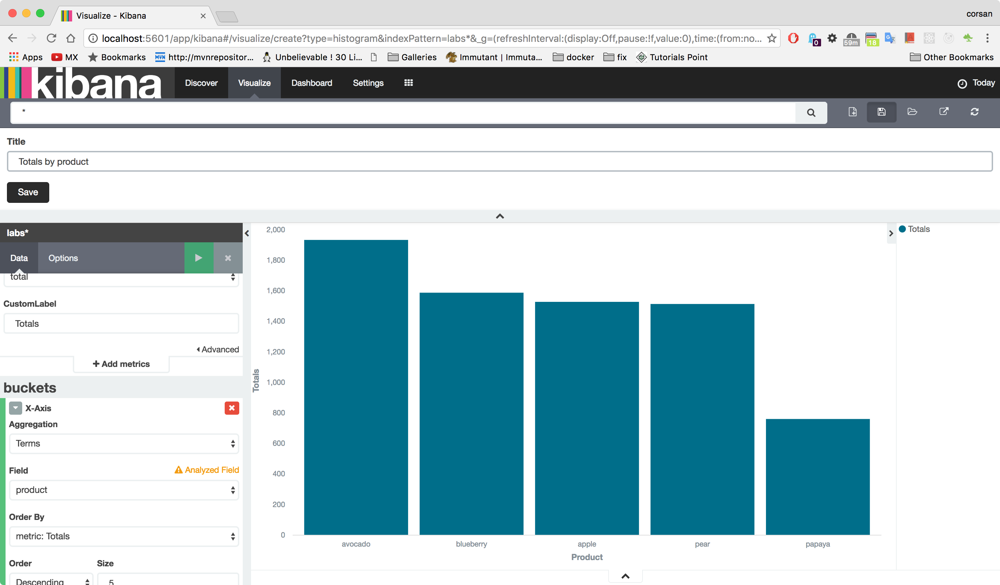
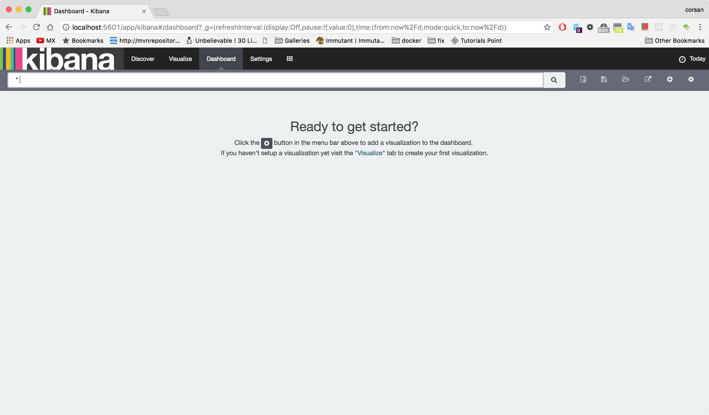
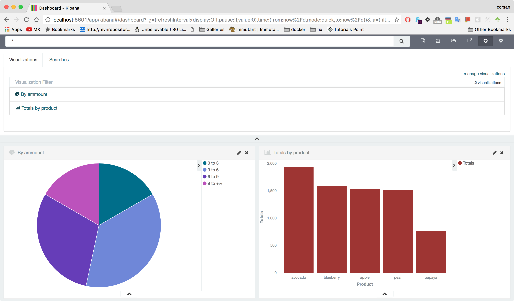

title: Lab 5 - Caudal Integration
---
A lab exercises intended to show how to integrate Caudal with Elasticsearch database and another Caudal nodes 


## Requirements
 * Have successfully completed **Lab 4**: [Correlation Streamers](lab4.html)


## Setting up an event enricher streamer

1. Change current directory to the **caudal-labs** project

```
$ cd caudal-labs/
```

2. Edit **config/caudal-config.clj** file to configure a **dafault** streamer that transform incomming messages and send them to the Elasticsearch database.
```
(ns caudal-labs)

(require '[mx.interware.caudal.io.elastic :as elastic])
(require '[mx.interware.caudal.streams.common :refer :all])
(require '[mx.interware.caudal.streams.stateful :refer :all])
(require '[mx.interware.caudal.streams.stateless :refer :all])

(defn calculate-iva [event]
  (let [price     (:price event)
        ammount   (:ammount event)
        sub-total (* ammount price)
        iva       (* 0.16 sub-total)
        total     (+ sub-total iva)]
    (assoc event :sub-total sub-total :iva iva :total total)))

(defsink streamer-1 10000
  (smap [calculate-iva]
        (printe ["Transformed event : "])
        (elastic/elastic-store! ["http://localhost:9200/" "labs" "sales"])))

(deflistener tcp-listener [{:type 'mx.interware.caudal.io.tcp-server 
                            :parameters {:port 9900
                                         :idle-period 60}}])

(wire [tcp-listener] [streamer-1])
```


## Starting Elasticsearch

1. Open a new terminal an change current directory to the one containing **elasticsearch** installation.

```
$ cd /opt/elasticsearch-2.4.0
```

2. Start Elasticsearch database

```
$ bin/elasticsearch
[2017-01-23 17:20:06,303][INFO ][node                     ] [Snowbird] version[2.4.0], pid[65564], build[ce9f0c7/2016-08-29T09:14:17Z]
[2017-01-23 17:20:06,304][INFO ][node                     ] [Snowbird] initializing ...
[2017-01-23 17:20:06,985][INFO ][plugins                  ] [Snowbird] modules [reindex, lang-expression, lang-groovy], plugins [], sites []
[2017-01-23 17:20:07,016][INFO ][env                      ] [Snowbird] using [1] data paths, mounts [[/ (/dev/disk1)]], net usable_space [13.9gb], net total_space [232.6gb], spins? [unknown], types [hfs]
[2017-01-23 17:20:07,016][INFO ][env                      ] [Snowbird] heap size [989.8mb], compressed ordinary object pointers [true]
[2017-01-23 17:20:07,017][WARN ][env                      ] [Snowbird] max file descriptors [10240] for elasticsearch process likely too low, consider increasing to at least [65536]
[2017-01-23 17:20:09,142][INFO ][node                     ] [Snowbird] initialized
[2017-01-23 17:20:09,142][INFO ][node                     ] [Snowbird] starting ...
[2017-01-23 17:20:09,225][INFO ][transport                ] [Snowbird] publish_address {127.0.0.1:9300}, bound_addresses {[fe80::1]:9300}, {[::1]:9300}, {127.0.0.1:9300}
[2017-01-23 17:20:09,229][INFO ][discovery                ] [Snowbird] elasticsearch/owhh9lBMT5mpFtEG43_XoA
[2017-01-23 17:20:12,269][INFO ][cluster.service          ] [Snowbird] new_master {Snowbird}{owhh9lBMT5mpFtEG43_XoA}{127.0.0.1}{127.0.0.1:9300}, reason: zen-disco-join(elected_as_master, [0] joins received)
[2017-01-23 17:20:12,283][INFO ][http                     ] [Snowbird] publish_address {127.0.0.1:9200}, bound_addresses {[fe80::1]:9200}, {[::1]:9200}, {127.0.0.1:9200}
[2017-01-23 17:20:12,283][INFO ][node                     ] [Snowbird] started
[2017-01-23 17:20:12,366][INFO ][gateway                  ] [Snowbird] recovered [5] indices into cluster_state
[2017-01-23 17:20:13,924][INFO ][cluster.routing.allocation] [Snowbird] Cluster health status changed from [RED] to [YELLOW] (reason: [shards started [[.kibana][0]] ...]).
```

3. Clean Elasticsearch **labs** index

```
$ curl -XDELETE 'http://localhost:9200/labs*/'
{"acknowledged":true}$
```


## Feeding event streamer

1. Restart Caudal for applying changes in configuration.

```
$ ./bin/start-caudal.sh -c ./config/caudal-config.clj
Verifying JAVA instalation ...
...
17:24:45.772 [main] INFO  mx.interware.caudal.core.starter-dsl - {:loading-dsl {:file ./config/caudal-config.clj}}
17:24:47.893 [main] INFO  mx.interware.caudal.io.tcp-server - Starting server on port :  9900  ...
```


2. Open another terminal and send through the **tcp channel** the events shown below.
```
$ telnet localhost 9900
Trying ::1...
Connected to localhost.
Escape character is '^]'.
{:tx "sale", :product "pear", :price 37.3, :time #inst"2017-01-16T19:14:50.522-00:00", :ammount 1}
{:tx "sale", :product "pear", :price 37.3, :time #inst"2017-01-16T19:14:50.596-00:00", :ammount 2}
{:tx "sale", :product "papaya", :price 20.5, :time #inst"2017-01-16T19:14:50.622-00:00", :ammount 4}
{:tx "sale", :product "mango", :price 23.0, :time #inst"2017-01-16T19:14:50.659-00:00", :ammount 5}
{:tx "sale", :product "avocado", :price 52.1, :time #inst"2017-01-16T19:14:50.739-00:00", :ammount 2}
{:tx "sale", :product "pear", :price 37.3, :time #inst"2017-01-16T19:14:50.824-00:00", :ammount 7}
{:tx "sale", :product "avocado", :price 52.1, :time #inst"2017-01-16T19:14:50.864-00:00", :ammount 4}
{:tx "sale", :product "apple", :price 42.5, :time #inst"2017-01-16T19:14:50.901-00:00", :ammount 4}
{:tx "sale", :product "apple", :price 42.5, :time #inst"2017-01-16T19:14:50.935-00:00", :ammount 9}
{:tx "sale", :product "blueberry", :price 65.2, :time #inst"2017-01-16T19:14:51.030-00:00", :ammount 1}
{:tx "sale", :product "papaya", :price 20.5, :time #inst"2017-01-16T19:14:51.074-00:00", :ammount 2}
{:tx "sale", :product "apple", :price 42.5, :time #inst"2017-01-16T19:14:51.148-00:00", :ammount 6}
{:tx "sale", :product "pear", :price 37.3, :time #inst"2017-01-16T19:14:51.245-00:00", :ammount 5}
{:tx "sale", :product "apple", :price 42.5, :time #inst"2017-01-16T19:14:51.341-00:00", :ammount 5}
{:tx "sale", :product "blueberry", :price 65.2, :time #inst"2017-01-16T19:14:51.399-00:00", :ammount 9}
{:tx "sale", :product "avocado", :price 52.1, :time #inst"2017-01-16T19:14:51.456-00:00", :ammount 10}
{:tx "sale", :product "papaya", :price 20.5, :time #inst"2017-01-16T19:14:51.491-00:00", :ammount 4}
{:tx "sale", :product "avocado", :price 52.1, :time #inst"2017-01-16T19:14:51.583-00:00", :ammount 9}
{:tx "sale", :product "blueberry", :price 65.2, :time #inst"2017-01-16T19:14:51.665-00:00", :ammount 8}
{:tx "sale", :product "apple", :price 42.5, :time #inst"2017-01-16T19:14:51.676-00:00", :ammount 4}
{:tx "sale", :product "papaya", :price 20.5, :time #inst"2017-01-16T19:14:51.699-00:00", :ammount 7}
{:tx "sale", :product "pear", :price 37.3, :time #inst"2017-01-16T19:14:51.799-00:00", :ammount 6}
{:tx "sale", :product "pear", :price 37.3, :time #inst"2017-01-16T19:14:51.805-00:00", :ammount 7}
{:tx "sale", :product "blueberry", :price 65.2, :time #inst"2017-01-16T19:14:51.832-00:00", :ammount 3}
{:tx "sale", :product "papaya", :price 20.5, :time #inst"2017-01-16T19:14:51.934-00:00", :ammount 6}
{:tx "sale", :product "pear", :price 37.3, :time #inst"2017-01-16T19:14:51.983-00:00", :ammount 7}
{:tx "sale", :product "mango", :price 23.0, :time #inst"2017-01-16T19:14:51.995-00:00", :ammount 3}
{:tx "sale", :product "avocado", :price 52.1, :time #inst"2017-01-16T19:14:52.095-00:00", :ammount 7}
{:tx "sale", :product "apple", :price 42.5, :time #inst"2017-01-16T19:14:52.186-00:00", :ammount 3}
{:tx "sale", :product "papaya", :price 20.5, :time #inst"2017-01-16T19:14:52.229-00:00", :ammount 9}
...
```

3. Verify the generated log for the received events
```
...
17:25:34.674 [NioProcessor-2] INFO  o.a.m.filter.logging.LoggingFilter - RECEIVED: HeapBuffer[pos=0 lim=1016 cap=4096: 7B 3A 74 78 20 22 73 61 6C 65 22 2C 20 3A 70 72...]
17:25:34.682 [NioProcessor-2] DEBUG o.a.m.f.codec.ProtocolCodecFilter - Processing a MESSAGE_RECEIVED for session 1
17:25:34.690 [NioProcessor-2] INFO  o.a.m.filter.logging.LoggingFilter - RECEIVED: HeapBuffer[pos=0 lim=1024 cap=4096: 7B 3A 74 78 20 22 73 61 6C 65 22 2C 20 3A 70 72...]
17:25:34.690 [NioProcessor-2] DEBUG o.a.m.f.codec.ProtocolCodecFilter - Processing a MESSAGE_RECEIVED for session 1
17:25:34.695 [NioProcessor-2] INFO  o.a.m.filter.logging.LoggingFilter - RECEIVED: HeapBuffer[pos=0 lim=1016 cap=2048: 7B 3A 74 78 20 22 73 61 6C 65 22 2C 20 3A 70 72...]
17:25:34.695 [NioProcessor-2] DEBUG o.a.m.f.codec.ProtocolCodecFilter - Processing a MESSAGE_RECEIVED for session 1
Transformed event : {:tx "sale", :product "pear", :price 37.3, :time #inst "2017-01-16T19:14:50.522-00:00", :ammount 1, :caudal/latency 610069, :sub-total 37.3, :iva 5.968, :total 43.268}
17:25:34.699 [clojure-agent-send-pool-1] DEBUG mx.interware.caudal.io.elastic - Storing event(s) into ELS : {:tx "sale", :product "pear", :price 37.3, :time #inst "2017-01-16T19:14:50.522-00:00", :ammount 1, :caudal/latency 610069, :sub-total 37.3, :iva 5.968, :total 43.268}
Transformed event : {:tx "sale", :product "pear", :price 37.3, :time #inst "2017-01-16T19:14:50.596-00:00", :ammount 2, :caudal/latency 628490789, :sub-total 74.6, :iva 11.936, :total 86.536}
17:25:35.315 [clojure-agent-send-pool-2] DEBUG mx.interware.caudal.io.elastic - Storing event(s) into ELS : {:tx "sale", :product "pear", :price 37.3, :time #inst "2017-01-16T19:14:50.596-00:00", :ammount 2, :caudal/latency 628490789, :sub-total 74.6, :iva 11.936, :total 86.536}
Transformed event : {:tx "sale", :product "papaya", :price 20.5, :time #inst "2017-01-16T19:14:50.622-00:00", :ammount 4, :caudal/latency 666548765, :sub-total 82.0, :iva 13.120000000000001, :total 95.12}
...
Transformed event : {:tx "sale", :product "apple", :price 42.5, :time #inst "2017-01-16T19:14:52.186-00:00", :ammount 3, :caudal/latency 1353921330, :sub-total 127.5, :iva 20.400000000000002, :total 147.9}
17:25:36.053 [clojure-agent-send-pool-9] DEBUG mx.interware.caudal.io.elastic - Storing event(s) into ELS : {:tx "sale", :product "apple", :price 42.5, :time #inst "2017-01-16T19:14:52.186-00:00", :ammount 3, :caudal/latency 1353921330, :sub-total 127.5, :iva 20.400000000000002, :total 147.9}
Transformed event : {:tx "sale", :product "papaya", :price 20.5, :time #inst "2017-01-16T19:14:52.229-00:00", :ammount 9, :caudal/latency 1393990461, :sub-total 184.5, :iva 29.52, :total 214.02}
17:25:36.093 [clojure-agent-send-pool-9] DEBUG mx.interware.caudal.io.elastic - Storing event(s) into ELS : {:tx "sale", :product "papaya", :price 20.5, :time #inst "2017-01-16T19:14:52.229-00:00", :ammount 9, :caudal/latency 1393990461, :sub-total 184.5, :iva 29.52, :total 214.02}
...
```


## Verifying database contents

1. Open a new terminal and execute the query command shown for checking the events previously processed.
```
$ curl -XPOST 'localhost:9200/labs*/_search?pretty' -d '{"query": { "match_all": {} }}'
{
  "took" : 54,
  "timed_out" : false,
  "_shards" : {
    "total" : 5,
    "successful" : 5,
    "failed" : 0
  },
  "hits" : {
    "total" : 30,
    "max_score" : 1.0,
    "hits" : [ {
      "_index" : "labs",
      "_type" : "sales",
      "_id" : "AVnNpiWjzTntsm6U0JOB",
      "_score" : 1.0,
      "_source" : {
        "ammount" : 1,
        "sub-total" : 37.3,
        "created-on" : 1485213934701,
        "time" : "2017-01-16T19:14:50Z",
        "product" : "pear",
        "total" : 43.268,
        "tx" : "sale",
        "price" : 37.3,
        "caudal/latency" : 610069,
        "iva" : 5.968
      }
    }, {
      "_index" : "labs",
      "_type" : "sales",
      "_id" : "AVnNpib_zTntsm6U0JOD",
      "_score" : 1.0,
      "_source" : {
        "ammount" : 4,
        "sub-total" : 82.0,
        "created-on" : 1485213935354,
        "time" : "2017-01-16T19:14:50Z",
        "product" : "papaya",
        "total" : 95.12,
        "tx" : "sale",
        "price" : 20.5,
        "caudal/latency" : 666548765,
        "iva" : 13.120000000000001
      }
    },
...
        {
       "_index" : "labs",
       "_type" : "sales",
       "_id" : "AVnNpilazTntsm6U0JOZ",
       "_score" : 1.0,
       "_source" : {
         "ammount" : 6,
         "sub-total" : 123.0,
         "created-on" : 1485213935959,
         "time" : "2017-01-16T19:14:51Z",
         "product" : "papaya",
         "total" : 142.68,
         "tx" : "sale",
         "price" : 20.5,
         "caudal/latency" : 1261751929,
         "iva" : 19.68
       }
     }, {
       "_index" : "labs",
       "_type" : "sales",
       "_id" : "AVnNpibZzTntsm6U0JOC",
       "_score" : 1.0,
       "_source" : {
         "ammount" : 2,
         "sub-total" : 74.6,
         "created-on" : 1485213935316,
         "time" : "2017-01-16T19:14:50Z",
         "product" : "pear",
         "total" : 86.536,
         "tx" : "sale",
         "price" : 37.3,
         "caudal/latency" : 628490789,
         "iva" : 11.936
       }
     } ]
   }
 }
```


## Starting Kibana visualizer

1. Open a new terminal an change current directory to the one containing **kibana** installation.

```
$ cd /opt/kibana-4.6.0
```

2. Start Elasticsearch database

```
$ bin/kibana
  log   [13:32:24.931] [info][status][plugin:heatmap@0.1.0] Status changed from uninitialized to green - Ready
  log   [13:32:24.938] [info][status][plugin:line_sg@0.0.1] Status changed from uninitialized to green - Ready
...
  log   [13:32:26.665] [info][listening] Server running at http://0.0.0.0:5601
  log   [13:32:26.719] [info][status][plugin:elasticsearch@1.0.0] Status changed from yellow to green - Kibana index ready
```

3. Open url [http://localhost:5601](http://localhost:5601) in a browser and click on **Settings**.

4. Set the value **labs*** in the field **Index name or pattern** and select the value **time** in **Time-field name** field.


5. Click on button **Create**.


## Creating *Pie* visualization for event data generated

1. Verify that visualizations date range is correct.

2. Click on **Visualize** option and then in **Pie chart**.


3. Select **From new search** option.


4. Click on **Split Slices** buckets type.


5. Select **Range** in **Aggregation section** and **ammount** in **Field**. Add the four ranges shown in image below then **Apply changes**. 


6. Once you entered ranges, must save the visualization. For that click on **Save Visualization**, set **By ammount** value into **Title** field, then click button **Save**.


## Creating *Vertical bar chart* visualization for event data generated

1. Click on **Visualize** option and then in **Vertical bar chart**.


2. Select **From new search** option.


3. Expand **Y-Axis** in **metrics** section and fill the fields as shown.


4. Click **X-Axis** in **buckets** section, fill the fields as shown.


5. Press the **Apply changes** button.


6. Once you entered ranges, must save the visualization. For that click on **Save Visualization**, set **Totals by product** value into **Title** field, then click button **Save**.




## Creating a dashboard

1. Click on **Dashboard** option.


2. Click on **+** button to add a new dashboard.



3. Select visualizations previously created and resize them as shown.



4. Click on **Save dashboard** button.


5. Set **Sample Dashboard** as the name for the one just created.


6. Created dashboard should appear as shown below.


