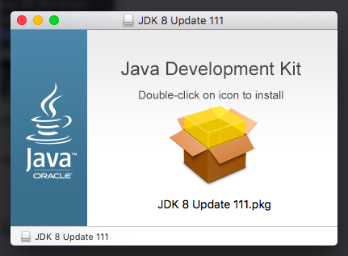

title: Instalar Java 8
---

## Linux RHEL 7 & CentOS 7
### Descargar el último Java

 **Nota:** *Si tu CentOS o RHEL es una instalación mínima reciente, tal vez debas instalar la utilería wget usando yum*

```#bash
# yum -y install wget
```
Descarga el último Java SE Development Kit 8 desde el sitio oficial de descargas usando los siguientes comandos para descargar desde una *shell*
```#bash
# cd /opt/
# wget --no-cookies --no-check-certificate --header "Cookie: gpw_e24=http%3A%2F%2Fwww.oracle.com%2F; oraclelicense=accept-securebackup-cookie" "http://download.oracle.com/otn-pub/java/jdk/8u111-b14/jdk-8u111-linux-x64.tar.gz"
# tar xzfv jdk-8u111-linux-x64.tar.gz
```
 **Nota:** *Para servidores en producción es altamente recomendable instalar Java Server JRE. El Server JRE incluye herramientas para monitorear la JVM y herramientas comúnmente requeridas para servidores de aplicaciones, pero no incluye la integración con navegadores (el plug-in de Java)*

```#bash
# cd /opt/
# wget --no-cookies --no-check-certificate --header "Cookie: gpw_e24=http%3A%2F%2Fwww.oracle.com%2F; oraclelicense=accept-securebackup-cookie" "http://download.oracle.com/otn-pub/java/jdk/8u111-b14/server-jre-8u111-linux-x64.tar.gz"
# tar xzfv server-jre-8u111-linux-x64.tar.gz
```

### Configurar Variables de Ambiente

La mayoria de las aplicaciones basadas en Java usan las variables de ambiente para trabajar. CentOS y RHEL proveen del directorio `/etc/profile.d/` para personalizar las variables de ambiente por aplicacion: 
```#bash
# echo "export JAVA_HOME=/opt/jdk1.8.0_111/" >> /etc/profile.d/java.sh
# echo "export JRE_HOME=/opt/jdk1.8.0_111/jre/" >> /etc/profile.d/java.sh
# echo "export PATH=\$PATH:\$JAVA_HOME/bin/:\$JRE_HOME/bin/" >> /etc/profile.d/java.sh
# source /etc/profile.d/java.sh
```

### Instalar Java con Alternatives

Después de cambiar las Variable de Ambiente, usa Alternatives para instalar Java
```#bash
# alternatives --install /usr/bin/java java $JAVA_HOME/bin/java 1
# alternatives --install /usr/bin/jar jar $JAVA_HOME/bin/jar 1
# alternatives --set java $JAVA_HOME/bin/java
# alternatives --set jar $JAVA_HOME/bin/jar
```

En este punto *Java 8* ha sido instalado satisfactoriamente en tu sistema.

 **Nota:** *Si realizaste esta instalación en un Servidor de Desarrollo, te recomentamos también la instalación del comando javac usando alternatives*

```#bash
# alternatives --install /usr/bin/javac javac $JAVA_HOME/bin/javac 1
# alternatives --set javac $JAVA_HOME/bin/javac
```

## Linux Debian & Ubuntu
### Descargar el último Java

 **Nota:** *Si tu Ubuntu o Debian es una instalación mínima reciente, tal vez debas instalar la utilería wget usando apt-get*

```#bash
$ sudo apt-get install wget
```
Descarga el último Java SE Development Kit 8 desde el sitio oficial de descargas usando los siguientes comandos para descargar desde una *shell*
```#bash
$ cd /opt/
$ sudo wget --no-cookies --no-check-certificate --header "Cookie: gpw_e24=http%3A%2F%2Fwww.oracle.com%2F; oraclelicense=accept-securebackup-cookie" "http://download.oracle.com/otn-pub/java/jdk/8u111-b14/jdk-8u111-linux-x64.tar.gz"
$ sudo tar xzfv jdk-8u111-linux-x64.tar.gz
```
 **Nota:** *Para servidores en producción es altamente recomendable instalar Java Server JRE. El Server JRE incluye herramientas para monitorear la JVM y herramientas comúnmente requeridas para servidores de aplicaciones, pero no incluye la integración con navegadores (el plug-in de Java)*

```#bash
$ cd /opt/
$ sudo wget --no-cookies --no-check-certificate --header "Cookie: gpw_e24=http%3A%2F%2Fwww.oracle.com%2F; oraclelicense=accept-securebackup-cookie" "http://download.oracle.com/otn-pub/java/jdk/8u111-b14/server-jre-8u111-linux-x64.tar.gz"
$ sudo tar xzfv server-jre-8u111-linux-x64.tar.gz
```

### Configurando las Variables de Ambiente

La mayoria de las aplicaciones basadas en Java usan las variables de ambiente para trabajar. Ubuntu y Debian proveen del directorio `/etc/profile.d/` para personalizar las variables de ambiente por aplicacion: 
```#bash
$ sudo echo "export JAVA_HOME=/opt/jdk1.8.0_111/" >> /etc/profile.d/java.sh
$ sudo echo "export JRE_HOME=/opt/jdk1.8.0_111/jre/" >> /etc/profile.d/java.sh
$ sudo echo "export PATH=\$PATH:\$JAVA_HOME/bin/:\$JRE_HOME/bin/" >> /etc/profile.d/java.sh
$ source /etc/profile.d/java.sh
```

### Instala Java con Alternatives

Después de cambiar las Variable de Ambiente, usa Alternatives para instalar Java
```#bash
$ sudo update-alternatives --install /usr/bin/java java $JAVA_HOME/bin/java 1
$ sudo update-alternatives --install /usr/bin/jar jar $JAVA_HOME/bin/jar 1
$ sudo update-alternatives --set java $JAVA_HOME/bin/java
$ sudo update-alternatives --set jar $JAVA_HOME/bin/jar
```

En este punto *Java 8* ha sido instalado satisfactoriamente en tu sistema.

 **Nota:** *Si realizaste esta instalación en un Servidor de Desarrollo, te recomentamos también la instalación del comando javac usando alternatives*

```#bash
$ sudo update-alternatives --install /usr/bin/javac javac $JAVA_HOME/bin/javac 1
$ sudo update-alternatives --set javac $JAVA_HOME/bin/javac
```

## MacOS X
### Descargar el último Java

 **Note:** *Si tu MacOS es una instalación reciente, tal vez debas instalar la utilería wget*

Primeramente, inicia Terminal (se encuentra en Aplicaciones/Utilidades). Descarga el último Java SE Development Kit 8 desde el sitio oficial de descargas usando los siguientes comandos:
```#bash
$ cd ~/Downloads/
$ wget --no-cookies --no-check-certificate --header "Cookie: gpw_e24=http%3A%2F%2Fwww.oracle.com%2F; oraclelicense=accept-securebackup-cookie" "http://download.oracle.com/otn-pub/java/jdk/8u111-b14/jdk-8u111-macosx-x64.dmg"
```
Abre el archivo descargado usando:
```#bash
$ open jdk-8u111-macosx-x64.dmg
```

Este comando lanza una ventana que contiene un archivo **pkg*. Haz doble click y sigue las instrucciones

