title: Lab 5 - Integración
---
Guía que muestra como integrar Caudal con ElasticSearch y Kibana

## Requerimientos
 * Haber completado satisfactoriamente **Lab 4**: [Estadísticas](lab4.html)

## Estableciendo un streamer enriquecedor de eventos

1. Cambia el actual directorio al proyecto **caudal-labs**
```txt
$ cd caudal-labs/
```
2. Edita el archivo **config/caudal-config.clj** para configurar un streamer que transforma los mensajes entrantes y los envia a una base de datos Elasticsearch
```clojure config/caudal-config.clj
(ns caudal-labs)

(require '[mx.interware.caudal.io.elastic :as elastic])
(require '[mx.interware.caudal.streams.common :refer :all])
(require '[mx.interware.caudal.streams.stateful :refer :all])
(require '[mx.interware.caudal.streams.stateless :refer :all])

(defn calculate-iva [event]
  (let [price     (:price event)
        ammount   (:ammount event)
        sub-total (* ammount price)
        iva       (* 0.16 sub-total)
        total     (+ sub-total iva)]
    (assoc event :sub-total sub-total :iva iva :total total)))

(defsink streamer-1 10000
  (smap [calculate-iva]
        (printe ["Transformed event : "])
        (elastic/elastic-store! ["http://localhost:9200/" "labs" "sales"])))

(deflistener tcp-listener [{:type 'mx.interware.caudal.io.tcp-server 
                            :parameters {:port 9900
                                         :idle-period 60}}])

(wire [tcp-listener] [streamer-1])
```

## Iniciando Elasticsearch
1. Abre una nueva terminal y cambia del directorio actual al que contiene la instalación de **Elasticsearch**
```txt
$ cd /opt/elasticsearch-2.4.0
```

2. Inicia la base de datos Elasticsearch
```txt
$ bin/elasticsearch
[2017-01-23 17:20:06,303][INFO ][node                     ] [Snowbird] version[2.4.0], pid[65564], build[ce9f0c7/2016-08-29T09:14:17Z]
[2017-01-23 17:20:06,304][INFO ][node                     ] [Snowbird] initializing ...
[2017-01-23 17:20:06,985][INFO ][plugins                  ] [Snowbird] modules [reindex, lang-expression, lang-groovy], plugins [], sites []
[2017-01-23 17:20:07,016][INFO ][env                      ] [Snowbird] using [1] data paths, mounts [[/ (/dev/disk1)]], net usable_space [13.9gb], net total_space [232.6gb], spins? [unknown], types [hfs]
[2017-01-23 17:20:07,016][INFO ][env                      ] [Snowbird] heap size [989.8mb], compressed ordinary object pointers [true]
[2017-01-23 17:20:07,017][WARN ][env                      ] [Snowbird] max file descriptors [10240] for elasticsearch process likely too low, consider increasing to at least [65536]
[2017-01-23 17:20:09,142][INFO ][node                     ] [Snowbird] initialized
[2017-01-23 17:20:09,142][INFO ][node                     ] [Snowbird] starting ...
[2017-01-23 17:20:09,225][INFO ][transport                ] [Snowbird] publish_address {127.0.0.1:9300}, bound_addresses {[fe80::1]:9300}, {[::1]:9300}, {127.0.0.1:9300}
[2017-01-23 17:20:09,229][INFO ][discovery                ] [Snowbird] elasticsearch/owhh9lBMT5mpFtEG43_XoA
[2017-01-23 17:20:12,269][INFO ][cluster.service          ] [Snowbird] new_master {Snowbird}{owhh9lBMT5mpFtEG43_XoA}{127.0.0.1}{127.0.0.1:9300}, reason: zen-disco-join(elected_as_master, [0] joins received)
[2017-01-23 17:20:12,283][INFO ][http                     ] [Snowbird] publish_address {127.0.0.1:9200}, bound_addresses {[fe80::1]:9200}, {[::1]:9200}, {127.0.0.1:9200}
[2017-01-23 17:20:12,283][INFO ][node                     ] [Snowbird] started
[2017-01-23 17:20:12,366][INFO ][gateway                  ] [Snowbird] recovered [5] indices into cluster_state
[2017-01-23 17:20:13,924][INFO ][cluster.routing.allocation] [Snowbird] Cluster health status changed from [RED] to [YELLOW] (reason: [shards started [[.kibana][0]] ...]).
```

3. Elimina el indice **labs** de Elasticsearch
```txt
$ curl -XDELETE 'http://localhost:9200/labs*/'
{"acknowledged":true}$
```


## Alimentando el streamer de eventos

1. Restaura Caudal para aplicar los cambios en la configuración.
```txt
$ ./bin/start-caudal.sh -c ./config/caudal-config.clj
Verifying JAVA instalation ...
...
17:24:45.772 [main] INFO  mx.interware.caudal.core.starter-dsl - {:loading-dsl {:file ./config/caudal-config.clj}}
17:24:47.893 [main] INFO  mx.interware.caudal.io.tcp-server - Starting server on port :  9900  ...
```

2. Abre otra terminal y envia a través del **canal tcp** los eventos como se muestra a continuación:
```txt
$ telnet localhost 9900
Trying ::1...
Connected to localhost.
Escape character is '^]'.
{:tx "sale", :product "pear", :price 37.3, :time #inst"2017-01-16T19:14:50.522-00:00", :ammount 1}
{:tx "sale", :product "pear", :price 37.3, :time #inst"2017-01-16T19:14:50.596-00:00", :ammount 2}
{:tx "sale", :product "papaya", :price 20.5, :time #inst"2017-01-16T19:14:50.622-00:00", :ammount 4}
{:tx "sale", :product "mango", :price 23.0, :time #inst"2017-01-16T19:14:50.659-00:00", :ammount 5}
{:tx "sale", :product "avocado", :price 52.1, :time #inst"2017-01-16T19:14:50.739-00:00", :ammount 2}
{:tx "sale", :product "pear", :price 37.3, :time #inst"2017-01-16T19:14:50.824-00:00", :ammount 7}
{:tx "sale", :product "avocado", :price 52.1, :time #inst"2017-01-16T19:14:50.864-00:00", :ammount 4}
{:tx "sale", :product "apple", :price 42.5, :time #inst"2017-01-16T19:14:50.901-00:00", :ammount 4}
{:tx "sale", :product "apple", :price 42.5, :time #inst"2017-01-16T19:14:50.935-00:00", :ammount 9}
{:tx "sale", :product "blueberry", :price 65.2, :time #inst"2017-01-16T19:14:51.030-00:00", :ammount 1}
{:tx "sale", :product "papaya", :price 20.5, :time #inst"2017-01-16T19:14:51.074-00:00", :ammount 2}
{:tx "sale", :product "apple", :price 42.5, :time #inst"2017-01-16T19:14:51.148-00:00", :ammount 6}
{:tx "sale", :product "pear", :price 37.3, :time #inst"2017-01-16T19:14:51.245-00:00", :ammount 5}
{:tx "sale", :product "apple", :price 42.5, :time #inst"2017-01-16T19:14:51.341-00:00", :ammount 5}
{:tx "sale", :product "blueberry", :price 65.2, :time #inst"2017-01-16T19:14:51.399-00:00", :ammount 9}
{:tx "sale", :product "avocado", :price 52.1, :time #inst"2017-01-16T19:14:51.456-00:00", :ammount 10}
{:tx "sale", :product "papaya", :price 20.5, :time #inst"2017-01-16T19:14:51.491-00:00", :ammount 4}
{:tx "sale", :product "avocado", :price 52.1, :time #inst"2017-01-16T19:14:51.583-00:00", :ammount 9}
{:tx "sale", :product "blueberry", :price 65.2, :time #inst"2017-01-16T19:14:51.665-00:00", :ammount 8}
{:tx "sale", :product "apple", :price 42.5, :time #inst"2017-01-16T19:14:51.676-00:00", :ammount 4}
{:tx "sale", :product "papaya", :price 20.5, :time #inst"2017-01-16T19:14:51.699-00:00", :ammount 7}
{:tx "sale", :product "pear", :price 37.3, :time #inst"2017-01-16T19:14:51.799-00:00", :ammount 6}
{:tx "sale", :product "pear", :price 37.3, :time #inst"2017-01-16T19:14:51.805-00:00", :ammount 7}
{:tx "sale", :product "blueberry", :price 65.2, :time #inst"2017-01-16T19:14:51.832-00:00", :ammount 3}
{:tx "sale", :product "papaya", :price 20.5, :time #inst"2017-01-16T19:14:51.934-00:00", :ammount 6}
{:tx "sale", :product "pear", :price 37.3, :time #inst"2017-01-16T19:14:51.983-00:00", :ammount 7}
{:tx "sale", :product "mango", :price 23.0, :time #inst"2017-01-16T19:14:51.995-00:00", :ammount 3}
{:tx "sale", :product "avocado", :price 52.1, :time #inst"2017-01-16T19:14:52.095-00:00", :ammount 7}
{:tx "sale", :product "apple", :price 42.5, :time #inst"2017-01-16T19:14:52.186-00:00", :ammount 3}
{:tx "sale", :product "papaya", :price 20.5, :time #inst"2017-01-16T19:14:52.229-00:00", :ammount 9}
...
```

3. Verifica la bitácora generada por los eventos recibidos
```txt
...
17:25:34.674 [NioProcessor-2] INFO  o.a.m.filter.logging.LoggingFilter - RECEIVED: HeapBuffer[pos=0 lim=1016 cap=4096: 7B 3A 74 78 20 22 73 61 6C 65 22 2C 20 3A 70 72...]
17:25:34.682 [NioProcessor-2] DEBUG o.a.m.f.codec.ProtocolCodecFilter - Processing a MESSAGE_RECEIVED for session 1
17:25:34.690 [NioProcessor-2] INFO  o.a.m.filter.logging.LoggingFilter - RECEIVED: HeapBuffer[pos=0 lim=1024 cap=4096: 7B 3A 74 78 20 22 73 61 6C 65 22 2C 20 3A 70 72...]
17:25:34.690 [NioProcessor-2] DEBUG o.a.m.f.codec.ProtocolCodecFilter - Processing a MESSAGE_RECEIVED for session 1
17:25:34.695 [NioProcessor-2] INFO  o.a.m.filter.logging.LoggingFilter - RECEIVED: HeapBuffer[pos=0 lim=1016 cap=2048: 7B 3A 74 78 20 22 73 61 6C 65 22 2C 20 3A 70 72...]
17:25:34.695 [NioProcessor-2] DEBUG o.a.m.f.codec.ProtocolCodecFilter - Processing a MESSAGE_RECEIVED for session 1
Transformed event : {:tx "sale", :product "pear", :price 37.3, :time #inst "2017-01-16T19:14:50.522-00:00", :ammount 1, :caudal/latency 610069, :sub-total 37.3, :iva 5.968, :total 43.268}
17:25:34.699 [clojure-agent-send-pool-1] DEBUG mx.interware.caudal.io.elastic - Storing event(s) into ELS : {:tx "sale", :product "pear", :price 37.3, :time #inst "2017-01-16T19:14:50.522-00:00", :ammount 1, :caudal/latency 610069, :sub-total 37.3, :iva 5.968, :total 43.268}
Transformed event : {:tx "sale", :product "pear", :price 37.3, :time #inst "2017-01-16T19:14:50.596-00:00", :ammount 2, :caudal/latency 628490789, :sub-total 74.6, :iva 11.936, :total 86.536}
17:25:35.315 [clojure-agent-send-pool-2] DEBUG mx.interware.caudal.io.elastic - Storing event(s) into ELS : {:tx "sale", :product "pear", :price 37.3, :time #inst "2017-01-16T19:14:50.596-00:00", :ammount 2, :caudal/latency 628490789, :sub-total 74.6, :iva 11.936, :total 86.536}
Transformed event : {:tx "sale", :product "papaya", :price 20.5, :time #inst "2017-01-16T19:14:50.622-00:00", :ammount 4, :caudal/latency 666548765, :sub-total 82.0, :iva 13.120000000000001, :total 95.12}
...
Transformed event : {:tx "sale", :product "apple", :price 42.5, :time #inst "2017-01-16T19:14:52.186-00:00", :ammount 3, :caudal/latency 1353921330, :sub-total 127.5, :iva 20.400000000000002, :total 147.9}
17:25:36.053 [clojure-agent-send-pool-9] DEBUG mx.interware.caudal.io.elastic - Storing event(s) into ELS : {:tx "sale", :product "apple", :price 42.5, :time #inst "2017-01-16T19:14:52.186-00:00", :ammount 3, :caudal/latency 1353921330, :sub-total 127.5, :iva 20.400000000000002, :total 147.9}
Transformed event : {:tx "sale", :product "papaya", :price 20.5, :time #inst "2017-01-16T19:14:52.229-00:00", :ammount 9, :caudal/latency 1393990461, :sub-total 184.5, :iva 29.52, :total 214.02}
17:25:36.093 [clojure-agent-send-pool-9] DEBUG mx.interware.caudal.io.elastic - Storing event(s) into ELS : {:tx "sale", :product "papaya", :price 20.5, :time #inst "2017-01-16T19:14:52.229-00:00", :ammount 9, :caudal/latency 1393990461, :sub-total 184.5, :iva 29.52, :total 214.02}
...
```

## Verifica el contenido de la base de datos

1. Abre una terminal nueva y ejecuta el comando query que se muestra para revisar los eventos previamente procesados.
```txt
$ curl -XPOST 'localhost:9200/labs*/_search?pretty' -d '{"query": { "match_all": {} }}'
{
  "took" : 54,
  "timed_out" : false,
  "_shards" : {
    "total" : 5,
    "successful" : 5,
    "failed" : 0
  },
  "hits" : {
    "total" : 30,
    "max_score" : 1.0,
    "hits" : [ {
      "_index" : "labs",
      "_type" : "sales",
      "_id" : "AVnNpiWjzTntsm6U0JOB",
      "_score" : 1.0,
      "_source" : {
        "ammount" : 1,
        "sub-total" : 37.3,
        "created-on" : 1485213934701,
        "time" : "2017-01-16T19:14:50Z",
        "product" : "pear",
        "total" : 43.268,
        "tx" : "sale",
        "price" : 37.3,
        "caudal/latency" : 610069,
        "iva" : 5.968
      }
    }, {
      "_index" : "labs",
      "_type" : "sales",
      "_id" : "AVnNpib_zTntsm6U0JOD",
      "_score" : 1.0,
      "_source" : {
        "ammount" : 4,
        "sub-total" : 82.0,
        "created-on" : 1485213935354,
        "time" : "2017-01-16T19:14:50Z",
        "product" : "papaya",
        "total" : 95.12,
        "tx" : "sale",
        "price" : 20.5,
        "caudal/latency" : 666548765,
        "iva" : 13.120000000000001
      }
    },
...
        {
       "_index" : "labs",
       "_type" : "sales",
       "_id" : "AVnNpilazTntsm6U0JOZ",
       "_score" : 1.0,
       "_source" : {
         "ammount" : 6,
         "sub-total" : 123.0,
         "created-on" : 1485213935959,
         "time" : "2017-01-16T19:14:51Z",
         "product" : "papaya",
         "total" : 142.68,
         "tx" : "sale",
         "price" : 20.5,
         "caudal/latency" : 1261751929,
         "iva" : 19.68
       }
     }, {
       "_index" : "labs",
       "_type" : "sales",
       "_id" : "AVnNpibZzTntsm6U0JOC",
       "_score" : 1.0,
       "_source" : {
         "ammount" : 2,
         "sub-total" : 74.6,
         "created-on" : 1485213935316,
         "time" : "2017-01-16T19:14:50Z",
         "product" : "pear",
         "total" : 86.536,
         "tx" : "sale",
         "price" : 37.3,
         "caudal/latency" : 628490789,
         "iva" : 11.936
       }
     } ]
   }
 }
```

## Iniciando el visualizador Kibana

1. Abre una nueva terminal y cambia el directorio actual a uno que contenga la instalación de **kibana**.
```txt
$ cd /opt/kibana-4.6.0
```

2. Inicia el visualizador Kibana
```txt
$ bin/kibana
  log   [13:32:24.931] [info][status][plugin:heatmap@0.1.0] Status changed from uninitialized to green - Ready
  log   [13:32:24.938] [info][status][plugin:line_sg@0.0.1] Status changed from uninitialized to green - Ready
...
  log   [13:32:26.665] [info][listening] Server running at http://0.0.0.0:5601
  log   [13:32:26.719] [info][status][plugin:elasticsearch@1.0.0] Status changed from yellow to green - Kibana index ready
```
3. Abre la url [http://localhost:5601](http://localhost:5601) en un navegador y haz click en **Settings**.

4. Cambia el valor a **labs*** en el campo **Index name or pattern** y selecciona el valor **time** en el campo **Time-field name**.
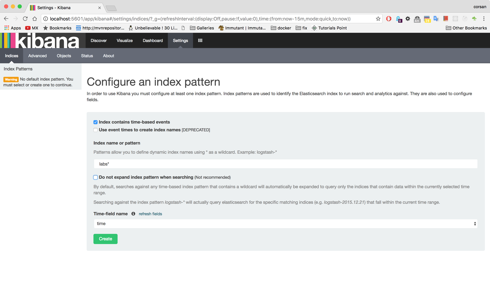

5. Haz click en el boton **Create**.
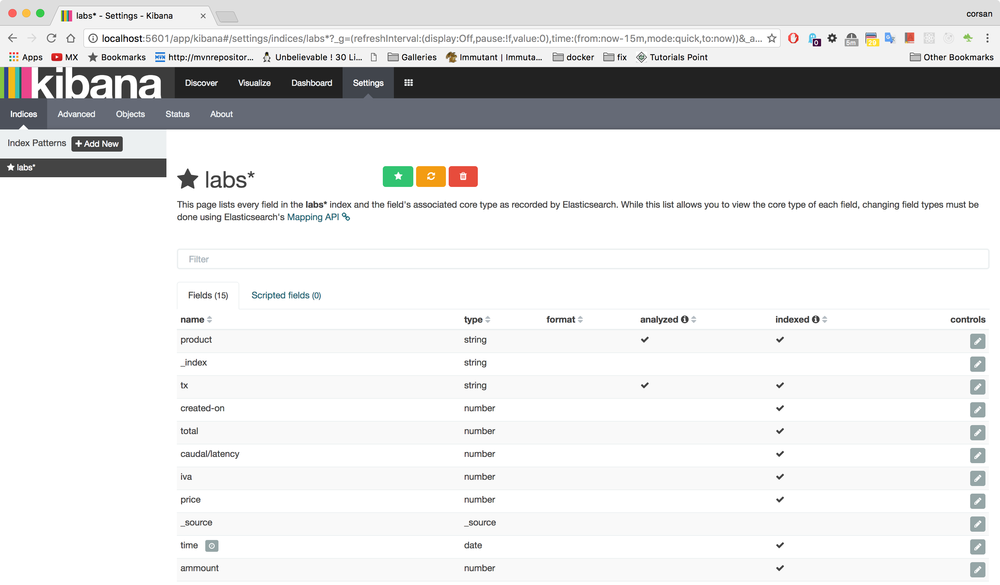

## Creando una visualización *Pie chart* para los eventos generados

1. Verifica que el rango de tiempo de las visualizaciones sea correcto.

2. Haz click en la opción **Visualize** y entonces en **Pie chart**
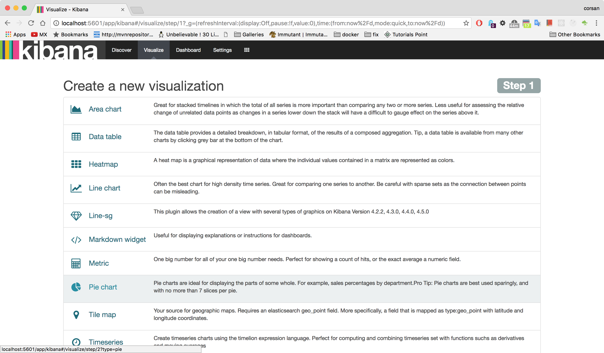

3. Selecciona la opción **From new search**.


4. Haz Click en el tipo de bucket **Split Slices**


5. Selecciona **Range** en la sección **Aggregation** y **ammount** en **Field**. Agrega los cuatro rangos mostrados en la imagen y entonces haz click en **Apply changes**
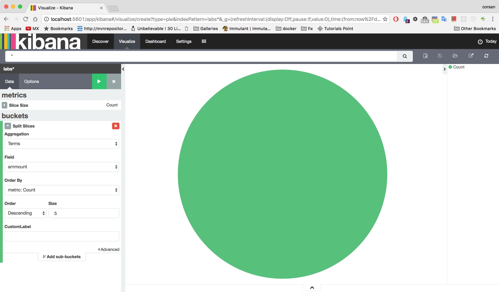

6. Una vez puestos los rangos, se debe guardar la visualización. Para ello haz click en **Save Visualization**, pon **By ammount** en el campo **Title**, entonces haz click en **Save**.


## Creando una visualización *Vertical bar chart* para los eventos generados

1. Haz click en la opción **Visualize** y entonces en **Vertical bar chart**.


2. Selecciona la opción **From new search** option.
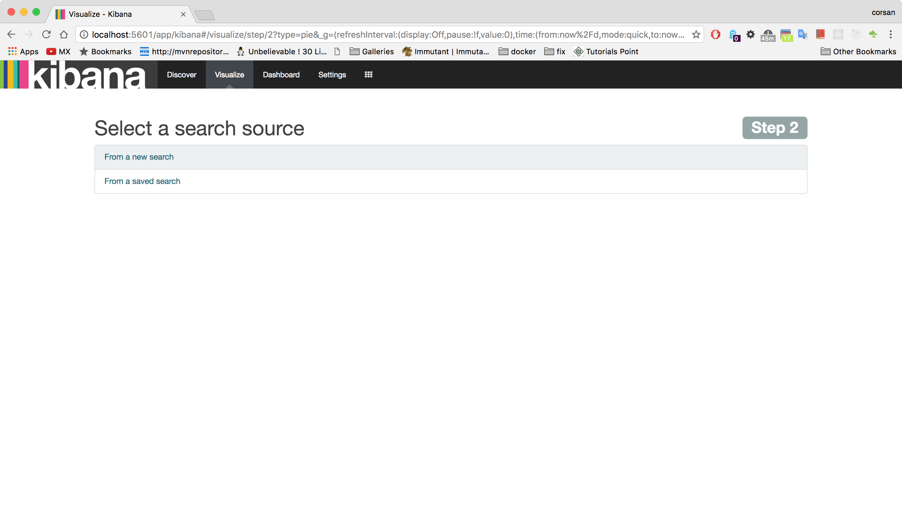

3. Expande **Y-Axis** en la sección **metrics** y llena los campos como se muestra a continuación.
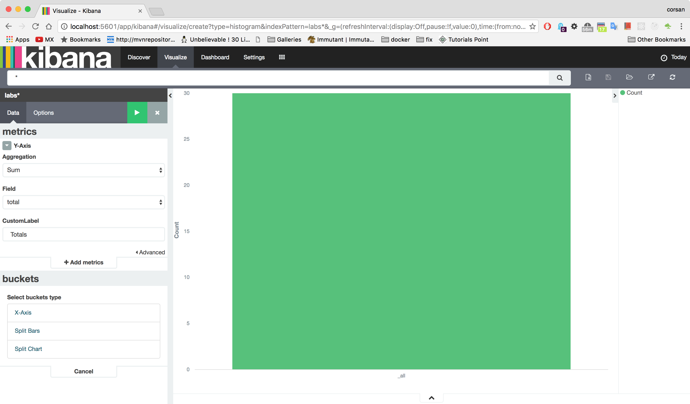

4. Haz click en **X-Axis** en la sección **buckets**, llena los campos como se muestra a continuación.
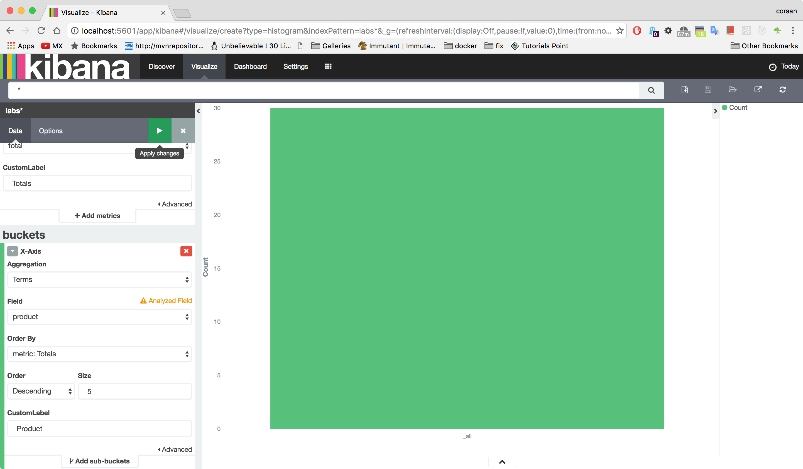

5. Presiona el botón **Apply changes**
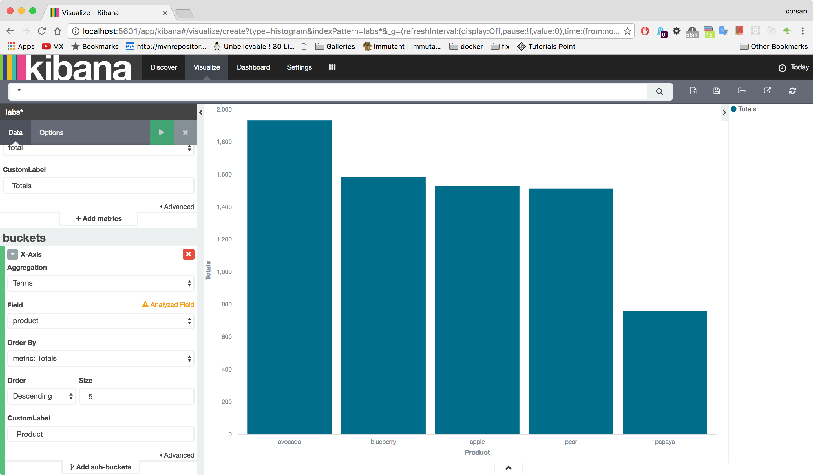

6. Una vez llenos los campos, se debe guardar la visualización. Para ello haz click en **Save Visualization**, pon **Totals by product** en el campo **Title**, entonces haz click en **Save**


## Creando un Dashboard
1. Haz click en la opción **Dashboard**.
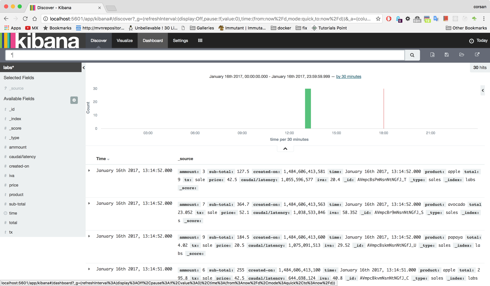

2. Haz click en el botón **+** para agregar una visualización.


3. Selecciona una de las visualizaciones previamente creadas y redimensionala como se muestra a continuación.


4. Haz click en el botón **Save dashboard**.


5. Cambia **Sample Dashboard** como el nombre para el que acabamos de crear.
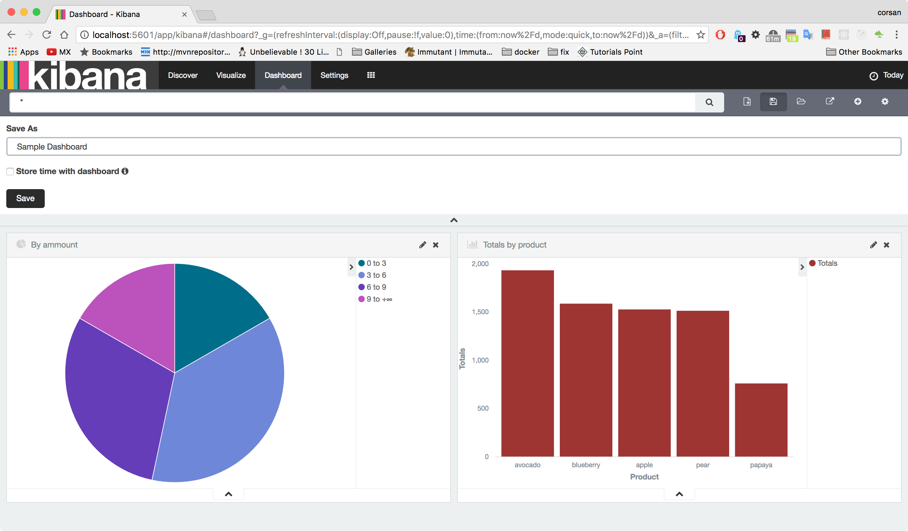

6. El dashboard creado debe aparecer como se muestra en la imagen.
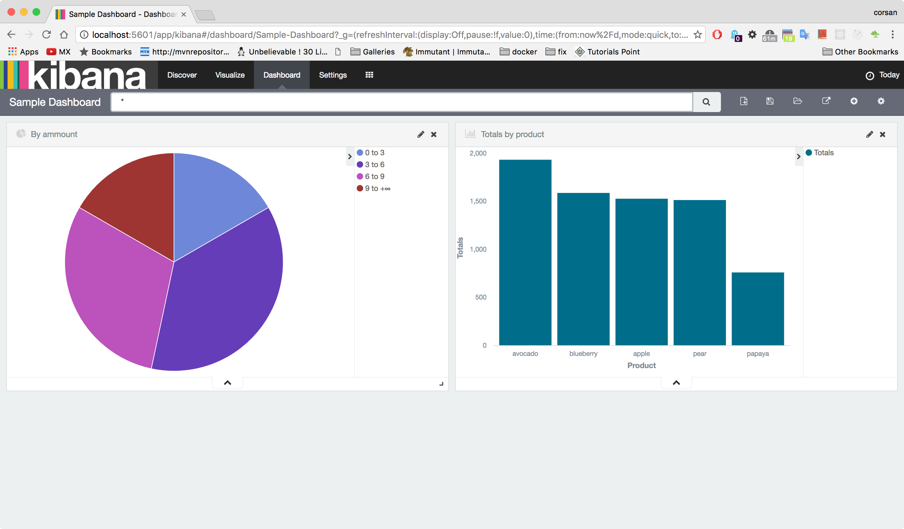


